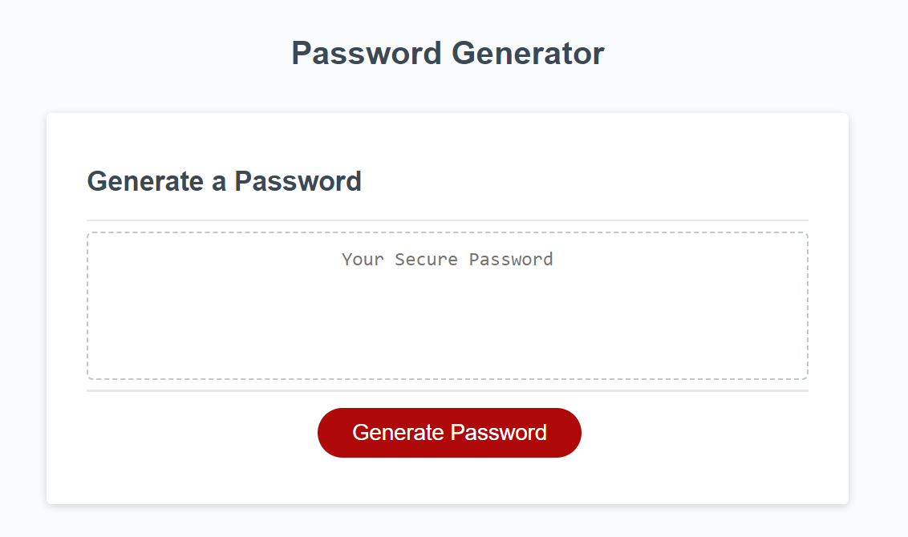

# 3-weekly-challenge
Week 3 Challenge - Password Generator

## Description

This repository contains the files for a random password generator. Using Javascript, the random password is created by first concatenating various arrays, as chosen by the user, into a larger array. Then, a loop is used to choose random index numbers of this larger array. Finally, the password is created by pushing elements of the larger array (using the random indices) into a new array that is then joined together into a string.

## Usage

https://joaqsala.github.io/3-weekly-challenge/

This webpage generates a random password for the user. Once the user starts the process, prompts ask the user to choose a character length for their password and then confirms whether they want to use lowercase letters, uppercase letters, numbers, and/or special characters. Once the user answers these questions, their random password is generated. 

## Credits

To my University of Texas Bootcamp Cohort that helps, pushes, and encourages me on.

## License

Please refer to LICENSE in repo.